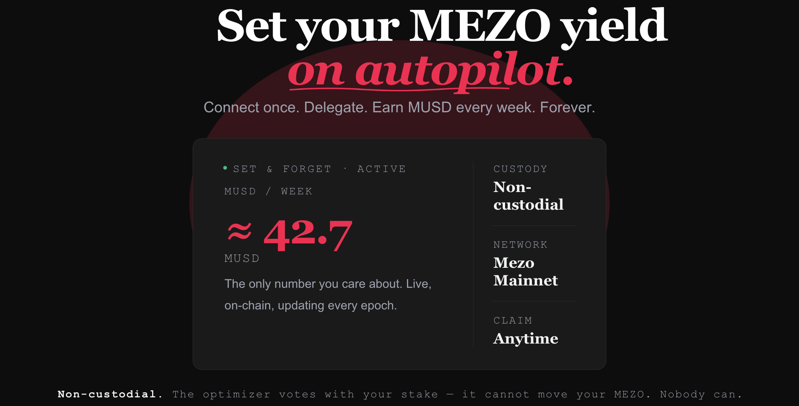

# MezoYield



**Set-and-forget MEZO yield. One CTA. Auto-vote the highest-incentive gauges every epoch — rewards in MUSD.**

Built for **Mezo Hack 2026** (Encode Club · MEZO Track).

- **Live demo (mainnet):** https://mainnet.mezoyield.xyz — chain `31612`
- **Live demo (testnet):** https://mezoyield.xyz — chain `31611`
- **In-app docs:** [/docs](https://mainnet.mezoyield.xyz/docs) (mainnet) · [/docs](https://mezoyield.xyz/docs) (testnet)
- **Wallet:** Connect via Mezo Passport (Bitcoin + EVM)

Each network ships as its own Coolify service with `NEXT_PUBLIC_MEZO_NETWORK` baked into the bundle, so the testnet demo's blast radius is isolated from any mainnet change.

---

## The problem

Mezo's gauge system rewards veMEZO holders who vote weekly for the gauges that maximize their MUSD yield. The mechanics are powerful but opaque:

- Holders must understand bribes, gauge weights, and basis points.
- They must vote **every week**, or rewards trail off.
- The optimization math (max MUSD/week per veMEZO unit) requires comparing live bribe data across gauges.

> *"We currently don't have anything that is like a simple way of getting yield on mezo token today."*
> — Andre Coutinho (Supernormal Foundation), MEZO Hack briefing

## The solution

MezoYield is the **one-click yield CTA** for Mezo:

1. **Connect** via Mezo Passport (Bitcoin + EVM).
2. **See** your veMEZO position, the live gauge board, and the epoch countdown.
3. **Click Auto-optimize** — the optimizer ranks gauges by `bribe / totalVeMezo` (annualized), distributes weights proportionally, and submits a single vote.
4. **Claim MUSD** rewards from the same screen. Watch your 8-week yield history populate.

Every screen anchors on **MUSD/week**, never raw veMEZO weights or basis points. Gauge addresses never leak to the UI — only human names. This is yield optimization framed for the user who wants the yield, not the governance dashboard.

## Features

- **Auto strategy** — single CTA, deterministic allocation by APY rank.
- **Manual strategy** — sliders + sum-to-100% gate for power users.
- **Position card** — veMEZO balance, current allocation, "≈ X MUSD/week" hero.
- **Gauge board** — live APY %, weekly bribe, my-weight column. Goldsky subgraph with on-chain RPC fallback.
- **Claim rewards** — single button: `Claim X.XX MUSD`. Post-success refetch + history invalidation so the chart reflects the new claim immediately.
- **Yield history** — last 8 epochs as a bar chart, contiguous calendar slots with zero-fill so gaps are visible.
- **Epoch countdown** — sticky `D:HH:MM:SS` to next epoch, with progress bar.

## Deployed contracts

Full tables (tx hashes, block numbers, the testnet-vs-mainnet wiring delta) in [TESTNET_ADDRESSES.md](./TESTNET_ADDRESSES.md). Canonical source is the on-disk manifests at `packages/contracts/deployments/mezo-{testnet,mainnet}.json` — the app loads them at build time via `NEXT_PUBLIC_MEZO_NETWORK`.

### Mezo Mainnet (chain `31612`)

Sourced from `packages/contracts/deployments/mezo-mainnet.json` — the manifest the app loads at build time.

| Slot                  | Address                                       | Real contract                                  |
|-----------------------|-----------------------------------------------|------------------------------------------------|
| `MezoYieldOptimizer`  | `0xCC79A460DACaB94b6e4C8cB74209488470cFAd53`  | `MezoYieldOptimizer`                           |
| `MockGaugeController` | `0x9811F510C87ddAcA311b41D21530c97213b2cA2A`  | `BoostVoterAdapter` (wraps real `BoostVoter`)  |
| `MockMatchbox`        | `0x96cDD2eD6fD82e34a747AC21d2F03637fAF69927`  | `MatchboxAdapter` (multiplexes per-gauge bribes) |
| `MockVeMezo`          | `0xE097c6E34C3FbfC906dF3c0C41232AED056A3b95`  | `VeMezoVotingPower` (sums NFT voting power)    |

Real Mezo contracts the adapters wrap:

| Name             | Address                                       |
|------------------|-----------------------------------------------|
| `MezoBoostVoter` | `0x2Ba614a598Cffa5a19d683cDCA97bac3a49313d1`  |
| `VeMEZO` (NFT)   | `0xb90fdAd3DFD180458D62Cc6acedc983D78E20122`  |
| `MEZO`           | `0x7B7c000000000000000000000000000000000001`  |
| `MUSD`           | `0xdD468A1DDc392dcdbEf6db6e34E89AA338F9F186`  |

Explorer: [explorer.mezo.org](https://explorer.mezo.org).

### Mezo Testnet (chain `31611`)

Sourced from `packages/contracts/deployments/mezo-testnet.json`.

| Slot                  | Address                                       | Real contract                |
|-----------------------|-----------------------------------------------|------------------------------|
| `MezoYieldOptimizer`  | `0x8cB8cC254B0Aa9d9ae4e621F17E191635FF1DdF9`  | `MezoYieldOptimizer`         |
| `MockGaugeController` | `0xa827809897E0B8C52d5513AEfB692FB406434b8E`  | `MockGaugeController` (mock) |
| `MockMatchbox`        | `0xc6B0A8340e6dE6f2B675aE3116FF1800684231D5`  | `MockMatchbox` (mock)        |
| `MockVeMezo`          | `0x2E9A3656BEBc3D5aB761bEa9cF913C38Fc0eB99f`  | `MockVeMezo` (mock)          |

Get tBTC at [faucet.test.mezo.org](https://faucet.test.mezo.org). Explorer: [explorer.test.mezo.org](https://explorer.test.mezo.org).

### Why slot names mention `Mock*` on mainnet

Both networks satisfy the same `IGaugeController` / `IMatchbox` / `IVeMezo` interfaces, so the Optimizer source is byte-identical across deploys. The slot names persist from the testnet manifest so the loader stays uniform; on mainnet the slots resolve to real-protocol **adapters** (`BoostVoterAdapter`, `MatchboxAdapter`, `VeMezoVotingPower`), not mocks. The Optimizer is **non-custodial** — no balances held, no `payable` functions, no stored token approvals.

## Run locally

```bash
pnpm install
pnpm dev                                                # http://localhost:3000
```

Other useful commands:

```bash
pnpm --filter @mezoyield/contracts test                 # Hardhat unit tests
pnpm --filter @mezoyield/app test                       # Vitest UI suites
pnpm test && pnpm lint                                  # quick local gate
```

## Architecture

- **Contracts** (`packages/contracts/`) — Solidity 0.8.28, Hardhat 2.22. Non-custodial optimizer + minimal mocks for testnet integration.
- **App** (`packages/app/`) — Next.js 14 App Router, Tailwind v4, shadcn/ui (`base-nova`). wagmi v2 + viem v2 for chain interaction, `@mezo-org/passport` for wallet connect, Recharts for the yield-history chart.
- **Keeper** (`packages/keeper/`) — long-running cron worker that nudges the optimizer at each epoch boundary.

See [CLAUDE.md](./CLAUDE.md) for the contributor guide (stack, commands, house rules), [docs/HOW_YIELD_WORKS.md](./docs/HOW_YIELD_WORKS.md) for the yield mechanics in plain English, and [docs/DEPLOY.md](./docs/DEPLOY.md) for the deployment reference.

## Mainnet flow notes

Two Mezo-mainnet quirks that the app now handles end-to-end (worth knowing if you read the contracts):

1. **Cosmos-side `approve` TTL handled automatically.** The MEZO token (`0x7B7c…0001`) is a Cosmos-native asset exposed as ERC-20 via a precompile. A standard EVM `approve()` sets the EVM allowance, but the precompile internally dispatches `cosmos.bank.MsgSend`, which carries a **separate Cosmos-side authorization** with its own TTL. If the Cosmos grant expires between approve and `createLock`, the next call reverts with `MsgSend authorization type does not exist or is expired`. The activation modal detects this revert in `useActivateStrategy` (`isCosmosTtlError`) and renders a one-click "Re-sign approval and retry" CTA in the Confirm tab — the retry re-fires the approve write, freshening the Cosmos grant, and the lock then succeeds in the same flow.
2. **Add to existing lock supported.** `VeMEZO.createLock` is first-lock only; the contract exposes `increaseAmount(tokenId, value)` for top-ups. The activation flow reads the user's existing veMEZO NFT via `useRealVeMezoPosition` and, when one is present, swaps the `createLock` call for `increaseAmount(existingTokenId, amount)`. The strategy modal's Lock tab switches its label from "Lock MEZO" → "Add to lock" so the UX makes the branch visible.

## License

MIT — see [LICENSE](./LICENSE).
